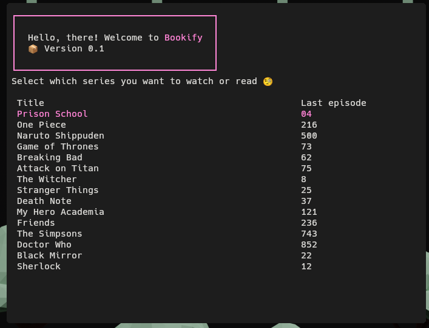

<p align="center">
  
</p>

# Bookify

⚠️ Your help is needed to make this project an AUR package and a good script to use for everyone 👍

[](LICENSE)

Welcome to Bookify a powerful terminal-based user interface for managing your video files, series, animes, and more! Say goodbye to cluttered file directories and hello to organized, interactive bliss.

## Features

- **Simplified Video Management**: Easily organize, search, and play your video files.
- **Series and Anime Tracking**: Keep track of your favorite series and animes, including episode progress.
- **Customization**: Tailor the library to your needs with customizable configurations.
- **User-Friendly Interface**: Enjoy a sleek, intuitive terminal interface powered by `gum`.

## How it works

This Bash script appears to be a CLI application for managing a library of TV series or movies. Here's a breakdown of its functionality:

1. **Dependencies Check:**

   - The script checks if the 'gum' command is available. If not, it provides instructions on how to install it based on the user's operating system.

2. **Initialization and Configuration:**

   - It initializes variables related to the configuration file and sets up paths.
   - There is a function (`TestIfFirstTime`) to check if it's the first time running the script. If so, it creates configuration files and directories.
   - Version information is displayed using the 'gum' command.

3. **Functions:**

   - `doLeadingZeroFill`: Adds leading zeros to a number.
   - `ColorOutput`: Displays colored text using the 'gum' command.
   - `getInfoSeries`: Reads information about a series from configuration files.
   - `doUpdateInfoSeries`: Updates information about a series in the configuration files.
   - `doTrackEpisode`: Tracks the episode being watched.
   - `LatestSeries`: Continues watching the latest series.
   - `ChooseEpisode`: Allows the user to choose a specific episode.
   - `doModifyInfoSeries`: Modifies information about a series.
   - `ModifyLibrary`: Modifies details of a series in the library.
   - `AddLibrary`: Adds a new series to the library.
   - `RemoveLibrary`: Removes a series from the library.
   - `ShowMenu`: Displays the main menu with options to continue watching, search for episodes, edit series, add a new series, or leave the application.

4. **Usage Flow:**

   - The script starts by checking dependencies and initializing configurations.
   - If it's the first time, it sets up the configuration files.
   - The main menu is then displayed, allowing the user to continue watching, search for episodes, edit series, add a new series, or leave the application.
   - Each option in the menu leads to different functions that perform specific tasks related to managing the library.

5. **User Interaction:**

   - The script uses 'gum' commands for user interaction, such as input prompts, confirmations, and choice menus.
   - Users can add, edit, and remove series from the library, choose specific episodes, and continue watching the latest series.

6. **Configurations:**

   - Series information and library details are stored in CSV files (`settings_series.csv` and `library.csv`).
   - The script allows users to customize series details such as name, episode format, folder path, and titled status.

7. **Additional Features:**

   - The script checks if episodes are titled and mentions that it can't predict the next episode in such cases.
   - There's an option to add leading zeros to episode numbers.

8. **Exit:**
   - The user can exit the application, and a goodbye message is displayed.

Please note that the script heavily relies on the 'gum' command, which seems to be a custom command-line tool for displaying formatted text and interacting with the user. If you have specific questions about certain parts of the script or if you need help with something specific, feel free to ask!

## Dependecies

- Gum for TUI [repo](https://github.com/charmbracelet/gum)

## Installation

1. Clone this repository:
   ```sh
   git clone https://github.com/giacomodelillo/Bookify.git
   cd Bookify
   ```
2. Make the script excutable
   ```
   chmod +x Bookify
   ```

## Contributing

We welcome contributions! Whether it's bug fixes, new features, or documentation improvements, your help is appreciated. Please read our Contribution Guidelines for more information.

## Acknowledgements

We would like to express our gratitude to the open-source community for their amazing contributions and support.
